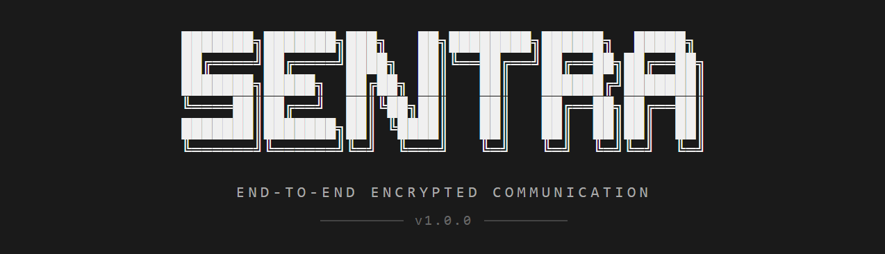

<div align="center">

<div align="center">
  
</div>
</br>

---

<div align="center">

[](https://git.io/typing-svg)

</div>

---

<div align="center">

<a href="https://github.com/Prathmesh-D/Sentra/releases/latest">
  
</a>

<a href="https://sentra-9c4d.onrender.com">
  
</a>

</div>
<br>


</div>

---

### Encrypt. Share. Control.

*Sentra is a full-stack secure file encryption and sharing platform. Every file is encrypted before upload and decrypted only by authorized recipients. It supports account-based access, recipient-controlled sharing, and inbox/outbox file management, and is available both in the browser and as a native Windows desktop app via Electron.*

<br>

<table>
<tr>
<td width="25%" valign="top">

**Encryption**
`AES-256-GCM`

Authenticated encryption with integrity verification on every payload

</td>
<td width="25%" valign="top">

**Access Control**
`Recipient-gated`

Only the intended recipient can decrypt, not even the server can read your data

</td>
<td width="25%" valign="top">

**Platform**
`Web + Desktop`

Runs in any browser or as a native Windows app via Electron

</td>
<td width="25%" valign="top">

**Deployment**
`Live on Render`

Backend and frontend both deployed — try it without any setup

</td>
</tr>
</table>

> **What makes Sentra different**
> - Zero knowledge server — messages are never stored in plaintext
> - Guest demo mode — try the app without creating an account
> - Inbox / outbox separation with unread count tracking
> - Built with Java, React, MongoDB Atlas, and Electron

<br/>

---

<div align="center">

[](https://sentra-9c4d.onrender.com)&nbsp;&nbsp;[](https://github.com/Prathmesh-D/Sentra/releases/latest)&nbsp;&nbsp;[](https://github.com/Prathmesh-D/Sentra/issues)

</div>

---

### What it does

<table width="100%">
  <tr>
    <td width="50%" valign="top" style="padding: 16px; border: 1px solid #d0d7de; border-radius: 10px;">
      <h3>Encrypt files</h3>
      Upload a file, Sentra encrypts it. Nobody can open it without being explicitly given access.
    </td>
    <td width="4%"></td>
    <td width="50%" valign="top" style="padding: 16px; border: 1px solid #d0d7de; border-radius: 10px;">
      <h3>Control who can open them</h3>
      Pick exactly who gets access. One person, a few people, or nobody yet. You can change your mind later.
    </td>
  </tr>
  <tr><td colspan="3" height="10"></td></tr>
  <tr>
    <td width="50%" valign="top" style="padding: 16px; border: 1px solid #d0d7de; border-radius: 10px;">
      <h3>Inbox &amp; Outbox</h3>
      Files you send and receive sit in clean inbox and outbox views. Filter, track status, see metadata. No digging through folders.
    </td>
    <td width="4%"></td>
    <td width="50%" valign="top" style="padding: 16px; border: 1px solid #d0d7de; border-radius: 10px;">
      <h3>Proper desktop app</h3>
      Installs on Windows like a real app. Start Menu, desktop shortcut, clean uninstall. No Electron jank visible to the user.
    </td>
  </tr>
  <tr><td colspan="3" height="10"></td></tr>
  <tr>
    <td width="50%" valign="top" style="padding: 16px; border: 1px solid #d0d7de; border-radius: 10px;">
      <h3>Sessions that make sense</h3>
      Sign in, stay signed in. See your active devices, revoke the ones you don't recognize, log out everywhere at once.
    </td>
    <td width="4%"></td>
    <td width="50%" valign="top" style="padding: 16px; border: 1px solid #d0d7de; border-radius: 10px;">
      <h3>Try it without signing up</h3>
      Hit "Explore Demo" on the login page. Instant access, pre-loaded with sample data, no account required. In and exploring in seconds.
    </td>
  </tr>
</table>

<br/>

---

### Get started in 30 seconds

<table width="100%" cellspacing="0" cellpadding="0">
  <tr>
    <td width="36" valign="top" align="center">
      <strong>1</strong>
    </td>
    <td valign="top" style="padding-left: 12px;">
      <strong>Open it in your browser</strong><br><br>
      <code>https://sentra-9c4d.onrender.com</code><br><br>
      Click <strong>Explore Demo</strong> on the login screen —
      no account, no setup. Just the app, fully loaded, ready to click through.<br><br>
      <blockquote>
        ⏱ &nbsp;The backend runs on a free host and may take up to 60 seconds to wake on the very first visit after a quiet period. After that it's instant.
      </blockquote>
    </td>
  </tr>
  <tr><td colspan="2" height="20"></td></tr>
  <tr>
    <td width="36" valign="top" align="center">
      <strong>2</strong>
    </td>
    <td valign="top" style="padding-left: 12px;">
      <strong>Or install it on Windows</strong><br><br>
      Grab the latest <code>.exe</code> from
      <a href="https://github.com/Prathmesh-D/Sentra/releases/latest"><strong>Releases →</strong></a><br><br>
      Standard Windows installer — Start Menu shortcut, desktop icon, uninstalls cleanly.<br>
      The desktop app talks to the same backend as the web version. Your account works on both.
    </td>
  </tr>
</table>
<br/>

---

### Project structure
<br>

```
Sentra/
│
├── backend/                   ☕ Java — encryption, auth, file handling
│   └── src/main/java/com/sentra/
│       ├── backend/           HTTP server, routes, auth, sessions, DB
│       └── crypto/            AES + RSA encryption core
│   └── Dockerfile
│
├── frontend/                  ⚛️  React — everything you see and click
│   └── src/
│       ├── views/             Login, Inbox, Encrypt, Settings, Dashboard
│       ├── components/        Shared UI pieces
│       ├── api/               Talks to the backend
│       ├── context/           Auth and UI state
│       └── hooks/             Custom React hooks
│   └── electron/              Turns the web app into a desktop app
│
├── .github/workflows/         ⚙️  Automated builds and releases
└── render.yaml                ☁️  Hosting config
```

<br/>

---

<div align="center">


Built by **[Prathmesh Deshkar](https://github.com/Prathmesh-D)**

*If it was useful or interesting, a star is always appreciated.*

[](https://github.com/Prathmesh-D/Sentra/stargazers)

---
</div>
